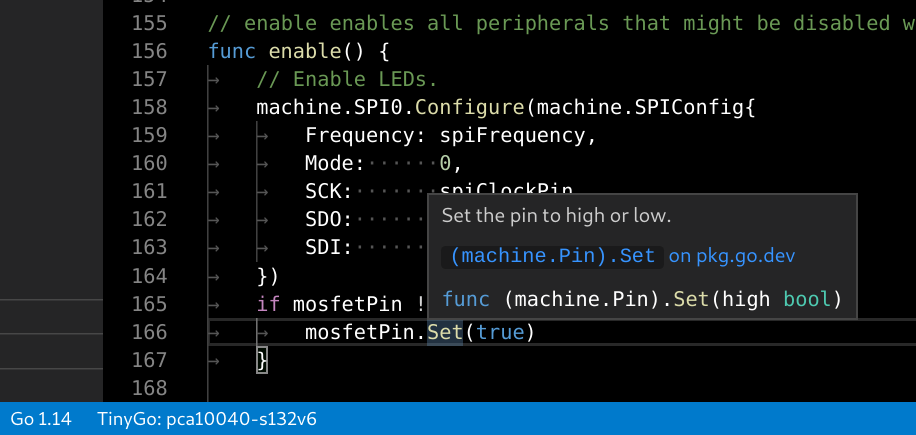

# Visual Studio Code support for TinyGo

This is a simple extension to add TinyGo support to Visual Studio Code.



## Features

Right now the only feature this extension supports is setting the right environment variables in the `.vscode/settings.json` of your workspace. For example, it may set the following configuration to work with the [BBC micro:bit](https://microbit.org/):

```json
{
    "go.toolsEnvVars": {
        "GOOS": "linux",
        "GOARCH": "arm",
        "GOROOT": "/home/user/.cache/tinygo/goroot-go1.14-f930d5b5f36579e8cbd1c139012b3d702281417fb6bdf67303c4697195b9ef1f-syscall",
        "GOFLAGS": "-tags=cortexm,baremetal,linux,arm,nrf51822,nrf51,nrf,microbit,tinygo,gc.conservative,scheduler.tasks"
    }
}
```

To use it, click on the `TinyGo` status bar element at the bottom of the screen and select a target. Alternatively, you could open the [command palette](https://code.visualstudio.com/docs/getstarted/userinterface#_command-palette) and search for `TinyGo target`.

Notes:

  * It is probably necessary to reload the window once you've set a new TinyGo target. You will be prompted for this if it's necessary.
  * If the Go extension asks you to rebuild tools because the `GOROOT` changed, don't do that. It will result in errors and not do what you expect. This is something that should be improved in a future version.

## Requirements

This extension depends on the following:

  * The [Go extension for VS Code](https://marketplace.visualstudio.com/items?itemName=golang.go). This extension should be automatically installed as a dependency.
  * The TinyGo compiler, version 0.15 or later. See [installation instructions for your operating system](https://tinygo.org/getting-started/).

## Development

For easy development, you can modify the package.json file a bit:

```diff
-       "main": "./dist/extension.js",
+       "main": "./out/extension.js",
```

There is probably a better way, but this works.

To create an extension as a package, run the following command:

    vsce package

This creates a new `vscode-tinygo-<version>.vsix` file that you can install directly in VS Code.
