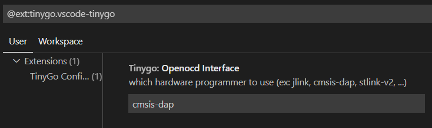

# Visual Studio Code support for TinyGo

This is a simple extension to add TinyGo support to Visual Studio Code.


## Features

The following features are supported.

  * Set the right environment variables in the `.vscode/settings.json` of your workspace
  * Add support for 'preview' functionality
  * Add debug settings to `.vscode/settings.json`, `.vscode/launch.json` and `.vscode/tasks.json` of your workspace

To use it, click on the `TinyGo` status bar element at the bottom of the screen and select a target. Alternatively, you could open the [command palette](https://code.visualstudio.com/docs/getstarted/userinterface#_command-palette) and search for `TinyGo target`.

Debugging can be started via `Run > StartDebugging (F5)`. At this time, debug using openocd is supported. The interface used by openocd can be changed from the following.



Notes:

  * It is probably necessary to reload the window once you've set a new TinyGo target. You will be prompted for this if it's necessary.
  * If the Go extension asks you to rebuild tools because the `GOROOT` changed, don't do that. It will result in errors and not do what you expect. This is something that should be improved in a future version.

## Requirements

This extension depends on the following:

  * The [Go extension for VS Code](https://marketplace.visualstudio.com/items?itemName=golang.go). This extension should be automatically installed as a dependency.
  * The TinyGo compiler, version 0.15 or later. See [installation instructions for your operating system](https://tinygo.org/getting-started/).
  * The [Cortex-Debug extension for VS Code](https://marketplace.visualstudio.com/items?itemName=marus25.cortex-debug). This extension should be automatically installed as a dependency.
  * for debug support
    * The TinyGo compiler, version 0.23 later. See [installation instructions for your operating system](https://tinygo.org/getting-started/).
    * See [Debugging - Debug Tinygo programs using GDB](https://tinygo.org/docs/guides/debugging/). At least tinygo gdb must work.

## Development

For easy development, you can modify the package.json file a bit:

```diff
-       "main": "./dist/extension.js",
+       "main": "./out/extension.js",
```

There is probably a better way, but this works.

To create an extension as a package, run the following command:

    vsce package

This creates a new `vscode-tinygo-<version>.vsix` file that you can install directly in VS Code.
